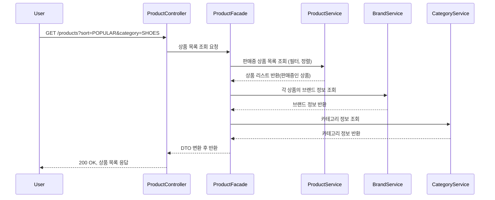
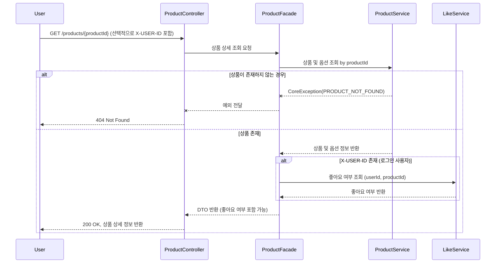
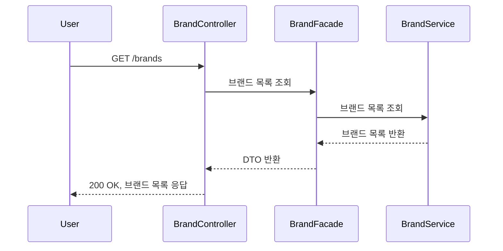
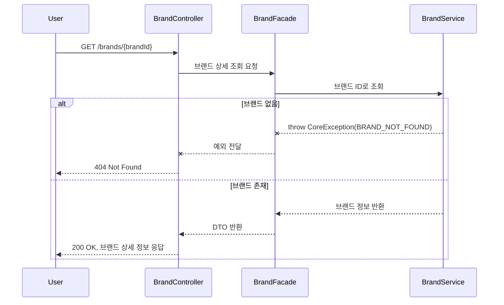
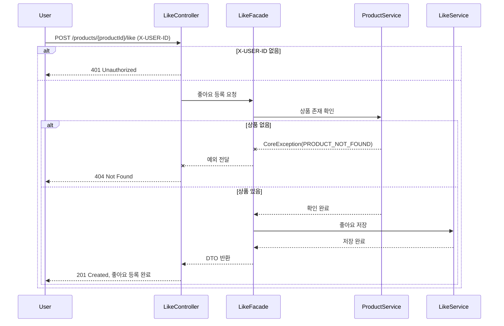
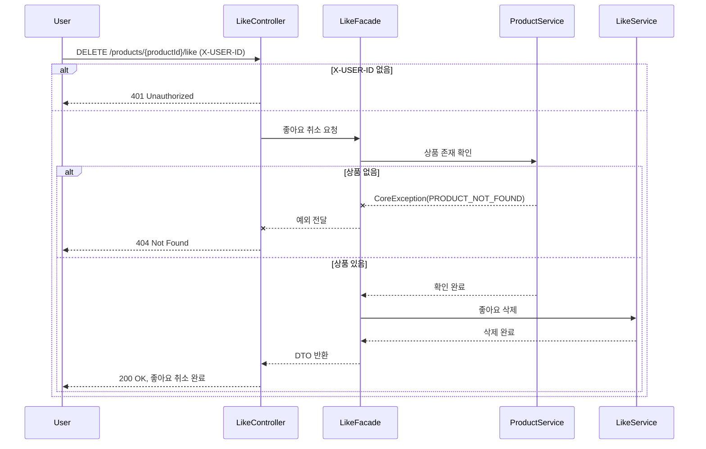
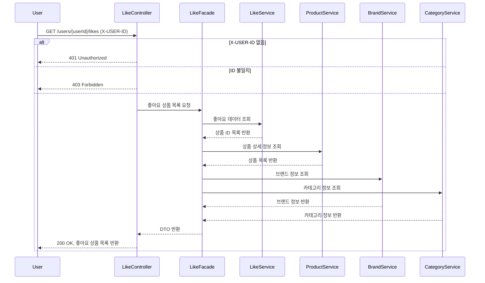
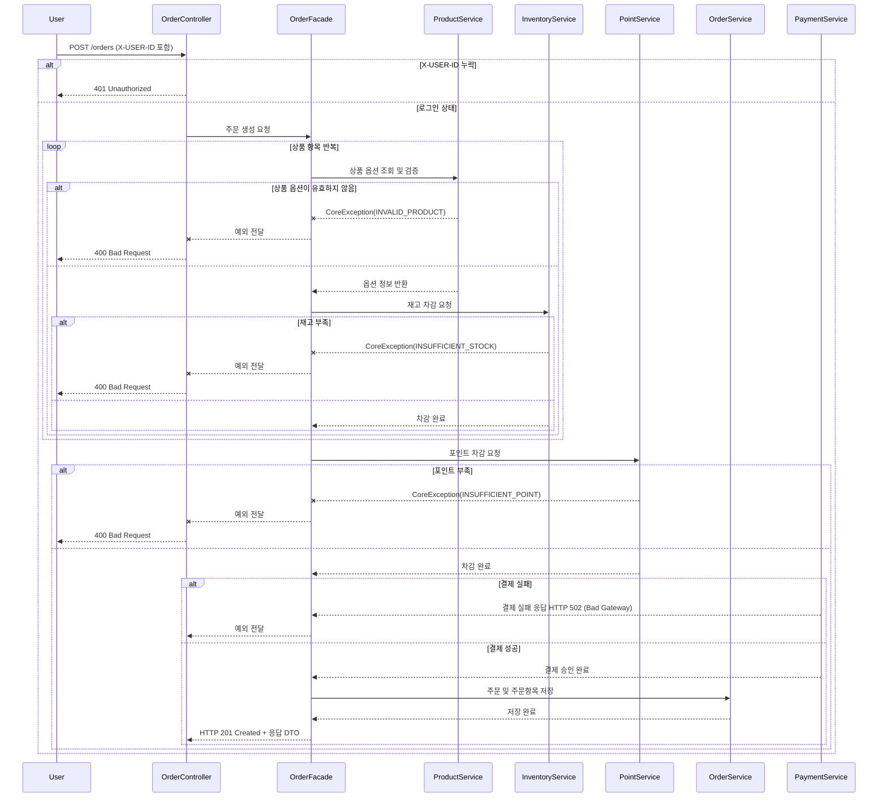
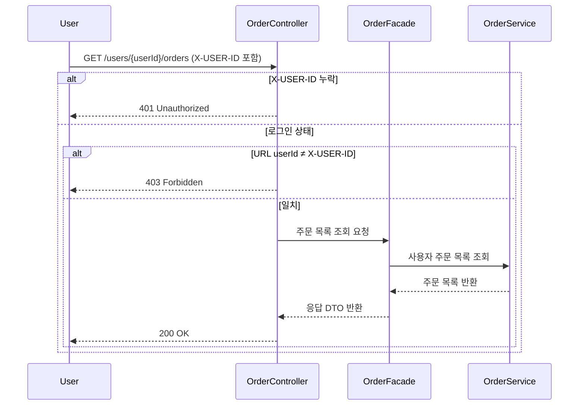
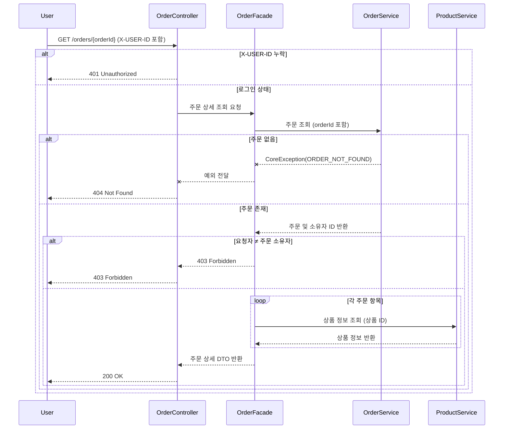

# 1) 상품 목록 조회

---

# 2) 상품 상세 조회

---

# 3) 브랜드 조회

## 3-1) 전체 브랜드 목록 조회

## 3-2) 특정 브랜드 상세 조회

---

# 4) 상품 좋아요 기능
## 4-1) 상품 좋아요 등록

## 4-2) 상품 좋아요 취소

## 4-3) 좋아요한 상품 목록 조회

---

# 5) 주문 / 결제

## 5-1) 주문 생성

## 5-2) 주문 목록 조회

## 5-3) 주문 상세 조회
