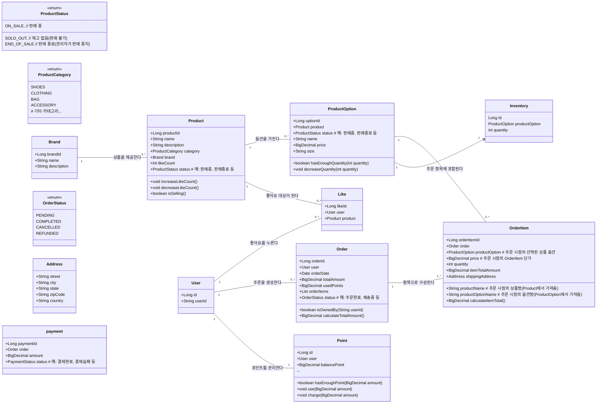

```mermaid
classDiagram
    direction LR

    class Product {
        +Long productId
        +String name
        +String description
        +ProductCategory category
        +Brand brand
        +int likeCount
        +ProductStatus status # 예: 판매중, 판매종료 등
        +void increaseLikeCount()
        +void decreaseLikeCount()
        +boolean isSelling()
    }
    
    class ProductStatus {
        <<enum>>
        ON_SALE,          // 판매 중
        SOLD_OUT,         // 재고 없음 (판매 불가)
        END_OF_SALE       // 판매 종료 (관리자가 판매 중지)
    }

    class ProductCategory  {
        <<enum>>
        SHOES
        CLOTHING
        BAG
        ACCESSORY
        # 기타 카테고리...
    }

    class ProductOption {
        +Long optionId
        +Product product
        +ProductStatus status # 예: 판매중, 판매종료 등
        +String name
        +BigDecimal price
        +String size
        +boolean hasEnoughQuantity(int quantity)
        +void decreaseQuantity(int quantity)
    }

    class Inventory {
        Long id
        ProductOption productOption
        int quantity
    }

    class Brand {
        +Long brandId
        +String name
        +String description
    }

    class User {
        +Long id
        +String userId
    }

    class Like {
        +Long likeId
        +User user
        +Product product
    }

    class Order {
        +Long orderId
        +User user
        +Date orderDate
        +BigDecimal totalAmount
        +BigDecimal usedPoints
        +List<OrderItem> orderItems
        +OrderStatus status # 예: 주문완료, 배송중 등
        +boolean isOwnedBy(String userId)
        +BigDecimal calculateTotalAmount()
    }

    class OrderStatus {
        <<enum>>
        PENDING
        COMPLETED
        CANCELLED
        REFUNDED
    }

    class Point {
        +Long id
        +User user
        +BigDecimal balancePoint
        --
        +boolean hasEnoughPoint(BigDecimal amount)
        +void use(BigDecimal amount)
        +void charge(BigDecimal amount)
    }

    class OrderItem {
        +Long orderItemId
        +Order order
        +ProductOption productOption # 주문 시점의 선택된 상품 옵션
        +BigDecimal price # 주문 시점의 OrderItem 단가
        +String productName # 주문 시점의 상품명 (Product에서 가져옴)
        +String productOptionName # 주문 시점의 옵션명 (ProductOption에서 가져옴)
        +int quantity
        +BigDecimal itemTotalAmount
        +Addrress shippingAddress
        +BigDecimal calculateItemTotal()
    }
    
    class Address {
        +String street
        +String city
        +String state
        +String zipCode
        +String country
    }
    
    class payment {
        +Long paymentId
        +Order order
        +BigDecimal amount
        +PaymentStatus status # 예: 결제완료, 결제실패 등
    }

    Product "1" -- "0..*" ProductOption : 옵션을 가진다
    Product "1" -- "0..*" Like : 좋아요 대상이 된다
    Brand "1" -- "0..*" Product : 상품을 제공한다
    User "1" -- "0..*" Like : 좋아요를 누른다
    User "1" -- "0..*" Order : 주문을 생성한다
    User "1" -- "1" Point : 포인트를 관리한다
    Order "1" -- "1..*" OrderItem : 항목으로 구성된다
    ProductOption "1" -- "0..*" OrderItem : 주문 항목에 포함된다
    ProductOption "1" --> "1" Inventory
```