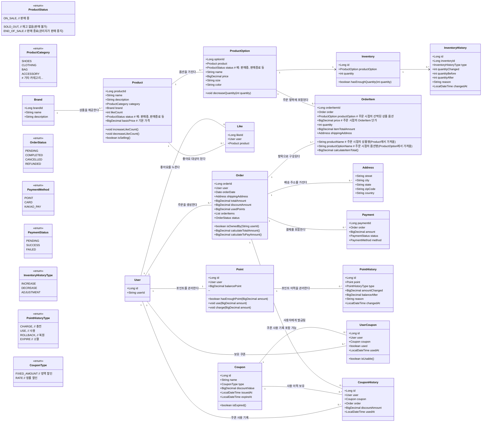

```mermaid
classDiagram
    direction LR

    class Product {
        +Long productId
        +String name
        +String description
        +ProductCategory category
        +Brand brand
        +int likeCount
        +ProductStatus status # 예: 판매중, 판매종료 등
        +BigDecimal basicPrice # 기본 가격
        +void increaseLikeCount()
        +void decreaseLikeCount()
        +boolean isSelling()
    }
    
    class ProductStatus {
        <<enum>>
        ON_SALE,          // 판매 중
        SOLD_OUT,         // 재고 없음 (판매 불가)
        END_OF_SALE       // 판매 종료 (관리자가 판매 중지)
    }

    class ProductCategory  {
        <<enum>>
        SHOES
        CLOTHING
        BAG
        ACCESSORY
        # 기타 카테고리...
    }

    class ProductOption {
        +Long optionId
        +Product product
        +ProductStatus status # 예: 판매중, 판매종료 등
        +String name
        +BigDecimal price
        +String size
        +String color
        +void decreaseQuantity(int quantity)
    }

    class Inventory {
        +Long id
        +ProductOption productOption
        +int quantity
        +boolean hasEnoughQuantity(int quantity)    
    }

    class InventoryHistory {
        +Long id
        +Long inventoryId
        +InventoryHistoryType type
        +int quantityChanged
        +int quantityBefore
        +int quantityAfter
        +String reason
        +LocalDateTime changedAt
    }

    class Brand {
        +Long brandId
        +String name
        +String description
    }

    class User {
        +Long id
        +String userId
    }

    class Like {
        +Long likeId
        +User user
        +Product product
    }

    class Order {
        +Long orderId
        +User user
        +Date orderDate
        +Address shippingAddress
        +BigDecimal totalAmount         
        +BigDecimal discountAmount      
        +BigDecimal usedPoints          
        +List<OrderItem> orderItems
        +OrderStatus status
        +boolean isOwnedBy(String userId)
        +BigDecimal calculateTotalAmount()
        +BigDecimal calculateToPayAmount()
    }

    class OrderStatus {
        <<enum>>
        PENDING
        COMPLETED
        CANCELLED
        REFUNDED
    }

    class Point {
        +Long id
        +User user
        +BigDecimal balancePoint
        --
        +boolean hasEnoughPoint(BigDecimal amount)
        +void use(BigDecimal amount)
        +void charge(BigDecimal amount)
    }

    class OrderItem {
        +Long orderItemId
        +Order order
        +ProductOption productOption # 주문 시점의 선택된 상품 옵션
        +BigDecimal price # 주문 시점의 OrderItem 단가
        +String productName # 주문 시점의 상품명 (Product에서 가져옴)
        +String productOptionName # 주문 시점의 옵션명 (ProductOption에서 가져옴)
        +int quantity
        +BigDecimal itemTotalAmount
        +Addrress shippingAddress
        +BigDecimal calculateItemTotal()
    }
    
    class Address {
        +String street
        +String city
        +String state
        +String zipCode
        +String country
    }
    
    class Payment {
        +Long paymentId
        +Order order
        +BigDecimal amount
        +PaymentStatus status
        +PaymentMethod method 
    }

    class PaymentMethod {
        <<enum>>
        POINT
        CARD
        KAKAO_PAY
    }

    class PaymentStatus {
        <<enum>>
        PENDING
        SUCCESS
        FAILED
    }
    
    class InventoryHistoryType {
        <<enum>>
        INCREASE
        DECREASE
        ADJUSTMENT
    }
    
    class PointHistory {
        +Long id
        +Point point
        +PointHistoryType type
        +BigDecimal amountChanged
        +BigDecimal balanceAfter
        +String reason
        +LocalDateTime changedAt
    }

    class PointHistoryType {
        <<enum>>
        CHARGE,       // 충전
        USE,          // 사용
        ROLLBACK,     // 복원
        EXPIRE        // 소멸
    }

    class Coupon {
        +Long id
        +String name
        +CouponType type
        +BigDecimal discountValue
        +LocalDateTime issuedAt
        +LocalDateTime expireAt
        +boolean isExpired()
    }

    class CouponType {
        <<enum>>
        FIXED_AMOUNT  // 정액 할인
        RATE          // 정률 할인
    }

    class UserCoupon {
        +Long id
        +User user
        +Coupon coupon
        +boolean used
        +LocalDateTime usedAt
        +boolean isUsable()
    }

    class CouponHistory {
        +Long id
        +User user
        +Coupon coupon
        +Order order
        +BigDecimal discountAmount
        +LocalDateTime usedAt
    }

    Product "1" -- "0..*" ProductOption : 옵션을 가진다
    Product "1" -- "0..*" Like : 좋아요 대상이 된다
    Brand "1" -- "0..*" Product : 상품을 제공한다
    User "1" -- "0..*" Like : 좋아요를 누른다
    User "1" -- "0..*" Order : 주문을 생성한다
    User "1" -- "1" Point : 포인트를 관리한다
    Order "1" -- "0..*" Payment : 결제를 포함한다
    Order "1" -- "0..*" Address : 배송 주소를 가진다
    Order "1" -- "1..*" OrderItem : 항목으로 구성된다
    ProductOption "1" -- "0..*" OrderItem : 주문 항목에 포함된다
    ProductOption "1" --> "1" Inventory
    Inventory "1" --> "0..*" InventoryHistory
    Point "1" -- "0..*" PointHistory : 포인트 이력을 관리한다
    User "1" -- "0..*" UserCoupon : 보유 쿠폰
    Coupon "1" -- "0..*" UserCoupon : 사용자에게 발급됨
    User "1" -- "0..*" CouponHistory : 쿠폰 사용 기록
    Coupon "1" -- "0..*" CouponHistory : 사용 이력 보유
    Order "1" -- "0..1" CouponHistory : 쿠폰 사용 기록 포함 가능
```