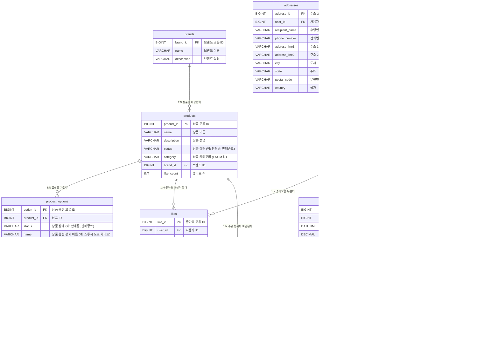

```mermaid
erDiagram
    products {
        BIGINT product_id PK "상품 고유 ID"
        VARCHAR name "상품 이름"
        VARCHAR description "상품 설명"
        VARCHAR status "상품 상태 (예: 판매중, 판매종료)"
        VARCHAR category "상품 카테고리 (ENUM 값)"
        BIGINT brand_id FK "브랜드 ID"
        INT like_count "좋아요 수"
    }

    product_options {
        BIGINT option_id PK "상품 옵션 고유 ID"
        BIGINT product_id FK "상품 ID"
        VARCHAR status "상품 상태 (예: 판매중, 판매종료)"
        VARCHAR name "상품 옵션 상세 이름 (예: 스투시 도쿄 화이트)"
        DECIMAL price "옵션 최종 가격"
        VARCHAR size "사이즈 (예: 270mm, L, XL)"
    }

    inventory {
        BIGINT product_option_id PK, FK "상품 옵션 ID (1:1 관계)"
        INT quantity "재고 수량"
    }

    brands {
        BIGINT brand_id PK "브랜드 고유 ID"
        VARCHAR name "브랜드 이름"
        VARCHAR description "브랜드 설명"
    }

    users {
        BIGINT id PK "사용자 고유 ID"
        VARCHAR user_id "사용자 로그인 ID"
    }

    points {
        BIGINT id PK "포인트 고유 ID"
        BIGINT user_id FK "사용자 ID"
        DECIMAL balance "포인트 잔액"
    }

    likes {
        BIGINT like_id PK "좋아요 고유 ID"
        BIGINT user_id FK "사용자 ID"
        BIGINT product_id FK "상품 ID"
    }

    orders {
        BIGINT order_id PK "주문 고유 ID"
        BIGINT user_id FK "주문 사용자 ID"
        DATETIME order_date "주문 일시"
        DECIMAL total_amount "총 주문 금액"
        DECIMAL used_points "사용 포인트"
        VARCHAR status "주문 상태 (예: 결제완료, 배송중)"
    }

    order_items {
        BIGINT order_item_id PK "주문 항목 고유 ID"
        BIGINT order_id FK "주문 ID"
        BIGINT product_id FK "상품 ID"
        BIGINT product_option_id FK "상품 옵션 ID"
        DECIMAL price "주문 시점 단가"
        VARCHAR product_name "상품 이름 (주문 시점)"
        VARCHAR product_option_name "옵션 이름 (주문 시점)"
        INT quantity "수량"
        DECIMAL item_total_amount "항목별 총액"
    }
    
    payments {
        BIGINT payment_id PK "결제 고유 ID"
        BIGINT order_id FK "주문 ID"
        VARCHAR payment_method "결제 방법 (예: 카드, 계좌이체)"
        DECIMAL amount "결제 금액"
        VARCHAR status "결제 상태 (예: 성공, 실패)"
    }
    
    addresses {
        BIGINT address_id PK "주소 고유 ID"
        BIGINT user_id FK "사용자 ID"
        VARCHAR recipient_name "수령인 이름"
        VARCHAR phone_number "전화번호"
        VARCHAR address_line1 "주소 1"
        VARCHAR address_line2 "주소 2 (선택)"
        VARCHAR city "도시"
        VARCHAR state "주/도"
        VARCHAR postal_code "우편번호"
        VARCHAR country "국가"
    }

    products ||--o{ product_options : "1:N 옵션을 가진다"
    products ||--o{ likes : "1:N 좋아요 대상이 된다"
    products ||--o{ order_items : "1:N 주문 항목에 포함된다"
    brands ||--o{ products : "1:N 상품을 제공한다"
    users ||--o{ likes : "1:N 좋아요를 누른다"
    users ||--o{ orders : "1:N 주문을 생성한다"
    users ||--|| points : "1:1 포인트를 관리한다"
    orders ||--o{ payments : "1:N 결제를 포함한다"
    orders ||--|{ order_items : "1:N 항목으로 구성된다"
    product_options }o--o{ order_items : "1:N 주문 시 선택될 수 있다"
    product_options ||--|| inventory : "1:1 재고 보유"
```