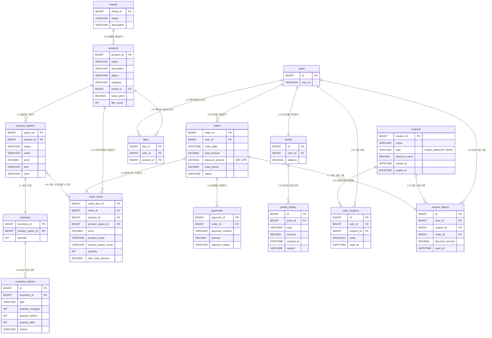

```mermaid
erDiagram
    products {
        BIGINT product_id PK
        VARCHAR name
        VARCHAR description
        VARCHAR status
        VARCHAR category
        BIGINT brand_id FK
        DECIMAL basic_price
        INT like_count
    }

    product_options {
        BIGINT option_id PK
        BIGINT product_id FK
        VARCHAR status
        VARCHAR name
        DECIMAL price
        VARCHAR size
        VARCHAR color
    }

    inventory {
        BIGINT inventory_id PK
        BIGINT product_option_id FK
        INT quantity
    }

    inventory_history {
        BIGINT id PK
        BIGINT inventory_id FK
        VARCHAR type
        INT quantity_changed
        INT quantity_before
        INT quantity_after
        VARCHAR reason
    }

    brands {
        BIGINT brand_id PK
        VARCHAR name
        VARCHAR description
    }

    users {
        BIGINT id PK
        VARCHAR user_id
    }

    points {
        BIGINT id PK
        BIGINT user_id FK
        DECIMAL balance
    }

    likes {
        BIGINT like_id PK
        BIGINT user_id FK
        BIGINT product_id FK
    }

    orders {
        BIGINT order_id PK
        BIGINT user_id FK
        DATETIME order_date
        DECIMAL total_amount
        DECIMAL discount_amount "할인 금액"
        DECIMAL used_points
        VARCHAR status
    }

    order_items {
        BIGINT order_item_id PK
        BIGINT order_id FK
        BIGINT product_id FK
        BIGINT product_option_id FK
        DECIMAL price
        VARCHAR product_name
        VARCHAR product_option_name
        INT quantity
        DECIMAL item_total_amount
    }

    payments {
        BIGINT payment_id PK
        BIGINT order_id FK
        VARCHAR payment_method
        DECIMAL amount
        VARCHAR payment_status
    }

    points_history {
        BIGINT id PK
        BIGINT point_id FK
        VARCHAR type
        DECIMAL amount
        DATETIME created_at
        VARCHAR reason
    }

    coupons {
        BIGINT coupon_id PK
        VARCHAR name
        VARCHAR type "FIXED_AMOUNT | RATE"
        DECIMAL discount_value
        DATETIME issued_at
        DATETIME expire_at
    }

    user_coupons {
        BIGINT id PK
        BIGINT user_id FK
        BIGINT coupon_id FK
        BOOLEAN used
        DATETIME used_at
    }

    coupon_history {
        BIGINT id PK
        BIGINT user_id FK
        BIGINT coupon_id FK
        BIGINT order_id FK
        DECIMAL discount_amount
        DATETIME used_at
    }

    products ||--o{ product_options : "1:N 옵션을 가진다"
    products ||--o{ likes : "1:N 좋아요 대상이 된다"
    products ||--o{ order_items : "1:N 주문 항목에 포함된다"
    brands ||--o{ products : "1:N 상품을 제공한다"
    users ||--o{ likes : "1:N 좋아요를 누른다"
    users ||--o{ orders : "1:N 주문을 생성한다"
    users ||--|| points : "1:1 포인트를 관리한다"
    orders ||--o{ payments : "1:N 결제를 포함한다"
    orders ||--|{ order_items : "1:N 항목으로 구성된다"
    product_options }o--o{ order_items : "1:N 주문 시 선택될 수 있다"
    product_options ||--|| inventory : "1:1 재고 보유"
    inventory ||--o{ inventory_history : "1:N 재고 변경 이력"
    points ||--o{ points_history : "1:N 포인트 변경 이력"

    users ||--o{ user_coupons : "1:N 쿠폰 보유"
    coupons ||--o{ user_coupons : "1:N 사용자에게 발급됨"
    users ||--o{ coupon_history : "1:N 쿠폰 사용 기록"
    coupons ||--o{ coupon_history : "1:N 쿠폰 사용 기록"
    orders ||--|| coupon_history : "1:1 쿠폰 사용 기록"
```